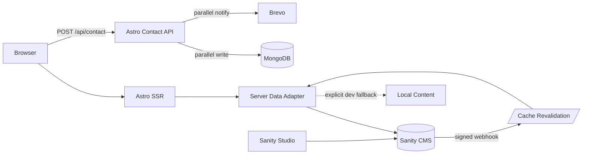

# Engineering Notebook Portfolio

A technical-publication-style portfolio built with Astro, TypeScript, React islands, Sanity, MongoDB, and Brevo.

## Architecture



Content and credentials cross server boundaries only. The browser receives rendered content and typed API responses—never database URIs, Brevo keys, or Sanity tokens.

## Key decisions

| Concern | Decision |
|---|---|
| Rendering | Astro SSR with React only for interactive islands |
| Content | Sanity behind an async data-source interface; local data is an explicit development fallback |
| Validation | Zod at CMS and contact API boundaries |
| Contact delivery | MongoDB and Brevo run independently; either channel succeeding counts as success |
| Media | Responsive two-up/one-up carousels; Sanity-managed journal images and project screenshots |
| Security | Server-only environment access plus an automated client-bundle credential scan |
| Content freshness | Short server cache cleared by a signed Sanity webhook |

## Development

```bash
npm install
cp .env.example .env
npm run dev       # portfolio
npm run studio    # Sanity Studio
```

Configuration is documented in `.env.example`. Useful maintenance commands:

```bash
npm run sanity:migrate-journal:dry
npm run sanity:migrate-journal
npm run build
```

## Copyright & attribution

© 2026 Mr. Developer. All rights reserved.

The visual system, Engineering Notebook concept, written content, and implementation may not be copied, redistributed, or presented as original work without permission. Forks or adaptations must retain visible attribution: **“Designed and engineered by Mr. Developer.”** Third-party packages and trademarks remain subject to their respective licenses.
